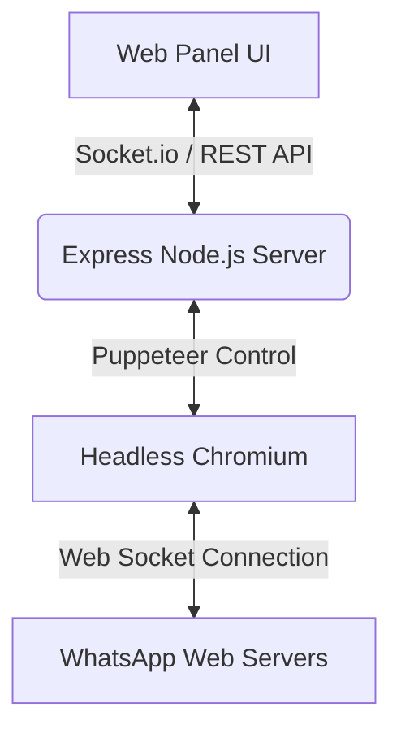

# WapDam - WhatsApp Automation Outreach Engine

[](https://github.com/ArnoBm/WapDam)

WapDam is a premium, self-hosted WhatsApp automation web application designed for cold marketing, lead generation, and customer outreach. Using a modern glassmorphism web panel, users can connect their own WhatsApp account via QR code, import contact lists, write personalized message templates, and automate message delivery safely.

You can access and track the repository at: **[https://github.com/ArnoBm/WapDam](https://github.com/ArnoBm/WapDam)**

---

## Project Overview

WapDam provides a graphical user interface (GUI) to interact with the unofficial WhatsApp Web API. It allows small businesses and marketers to perform bulk outreach directly from their own numbers without relying on expensive third-party APIs.



### Key Technical Architecture
*   **Backend**: Powered by [Node.js](https://nodejs.org/) and [Express](https://expressjs.com/).
*   **WhatsApp Integration**: Uses `whatsapp-web.js` to control a headless Chromium instance that mimics human browser behavior.
*   **Real-Time Progress**: Leverages `Socket.io` to stream logs, campaign statuses, and connection states to the user panel.
*   **Frontend**: A responsive Glassmorphism dashboard built with raw HTML, CSS, and Javascript.
*   **Session Management**: Persists local authentication states under `.wwebjs_auth` to keep the user logged in across restarts.

---

## Key Features

*   **Easy Setup & Session Persistence**: Connect your WhatsApp using QR code scanning. Session details are saved securely locally, keeping you logged in even after server restarts.
*   **Bulk Outreach Campaigns**: Import targets via `.csv` file upload or paste plain lists manually in `Number,Name,Company` formatting.
*   **Dynamic Message Personalization**: Write templated text with inline placeholders like `{Name}` and `{Company}` that replace dynamically for each target.
*   **Anti-Ban Guardrails**: Configure randomized cooldown intervals (delays) between messages (e.g. 5-15 seconds) to mimic human-like speed and prevent account blocks.
*   **Performance Optimized for Pocket Servers**: Configured to run efficiently on low-resource environments (like Raspberry Pi, Orange Pi, or Termux) with memory limit tweaks and headless environment optimizations.
*   **Live Terminal Logs**: Monitor delivery statuses real-time with live progress bars and color-coded debugging logs.
*   **Historical Campaign Archives**: Inspect past campaign logs, delivery ratios, duration stats, and delivery templates.

---

## Installation & Launch

Ensure you have [Node.js](https://nodejs.org/) (version 18+) installed.

1. **Clone the repository**:
   ```bash
   git clone https://github.com/ArnoBm/WapDam.git
   cd WapDam
   ```

2. **Install dependencies**:
   ```bash
   npm install
   ```

3. **Launch development server**:
   ```bash
   npm run dev
   ```

4. **Open application**:
   Open browser and navigate to `http://localhost:3000`.

---

## CSV Formatting Guide

Create a spreadsheet and export it as `.csv` with the following column headers in the first row:

```csv
number,name,company
8801700000000,Arnob,Google
8801811111111,Karim,SoftCorp
```

*   **number**: Required. Must contain international country prefixes (e.g., Bangladeshi format `88017XXXXXXXX` or Indian format `919XXXXXXXXX`).
*   **name**: Optional. Replaces `{Name}` variable in your templates.
*   **company**: Optional. Replaces `{Company}` variable in your templates.

---

## Anti-Ban Outreach Practices

> [!WARNING]
> Meta's systems monitor accounts for automation. Using unofficial tools carries a risk of number bans. Follow these recommendations to stay safe:

*   **Configure Reasonable Intervals**: Keep delay intervals high (e.g., minimum 10-20 seconds delay). Rapid firing will trigger instant spam algorithms.
*   **Vary Content**: Use variables like `{Name}` to ensure every message sent contains distinct content.
*   **Warm Up New Accounts**: Don't use a fresh, unused number to send hundreds of bulk messages immediately. Start with 15-20 messages a day and gradually increase.
*   **Validate Target Lists**: Avoid sending to unregistered WhatsApp numbers repeatedly as high bouncing ratios flag accounts. WapDam automatically checks number registration before sending.
